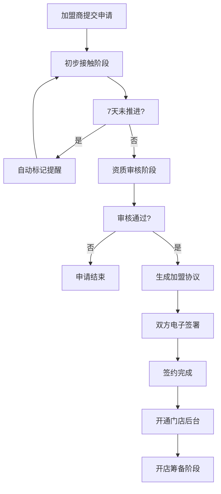

## 1. 产品概述
企业招商加盟管理平台，实现总部与加盟商的全流程数字化管理。解决传统招商模式中信息不对称、跟进效率低、商机易流失等痛点，打造从意向申请到签约开店的完整闭环。

- 主要用途：总部招商管理、加盟商申请与签约、门店运营支持
- 目标用户：企业招商专员、总部管理员、意向加盟商、已签约加盟商
- 核心价值：提升招商转化率、规范化加盟流程、降低运营成本

## 2. 核心功能

### 2.1 用户角色
| 角色 | 注册/登录方式 | 核心权限 |
|------|--------------|----------|
| 总部管理员 | 账号密码登录 | 发布政策/品牌、管理用户、查看数据看板、发布通知 |
| 招商专员 | 账号密码登录 | 跟进意向申请、记录沟通、推进阶段、生成协议 |
| 意向加盟商 | 在线提交信息自动创建 | 提交意向申请、查看申请进度、签署协议 |
| 已签约加盟商 | 账号密码登录 | 门店后台、查看资料/物料、接收通知 |

### 2.2 功能模块
1. **招商门户首页**：品牌介绍、加盟政策展示、在线申请入口
2. **总部管理后台**：申请管理、阶段推进、沟通记录、协议管理、通知发布、数据看板
3. **加盟商门店后台**：申请进度、协议签署、资料下载、通知中心
4. **数据看板**：城市意向分布、各阶段转化率、本月签约数、跟进提醒

### 2.3 页面详情
| 页面名称 | 模块名称 | 功能描述 |
|---------|---------|---------|
| 招商门户首页 | Hero区域 | 品牌展示、核心优势、加盟亮点 |
| 招商门户首页 | 政策展示 | 加盟条件、费用说明、支持政策 |
| 招商门户首页 | 在线申请 | 表单填写（基本信息、意向城市、资金） |
| 总部后台-仪表盘 | 数据概览 | 关键指标卡片、趋势图表 |
| 总部后台-申请列表 | 申请管理 | 列表展示、阶段筛选、搜索、批量操作 |
| 总部后台-申请详情 | 阶段管理 | 阶段推进时间线、状态标记 |
| 总部后台-申请详情 | 沟通记录 | 添加记录、历史记录列表、附件上传 |
| 总部后台-申请详情 | 协议生成 | 自动生成协议、预览、发送签署 |
| 总部后台-数据看板 | 数据可视化 | 城市分布图、转化漏斗图、月度趋势 |
| 总部后台-通知中心 | 通知管理 | 发布通知、选择受众、已读统计 |
| 总部后台-政策管理 | 内容编辑 | 发布/编辑加盟政策、品牌介绍 |
| 加盟商后台-首页 | 进度概览 | 当前阶段、待办事项 |
| 加盟商后台-协议签署 | 电子签署 | 协议预览、在线签署、签署完成 |
| 加盟商后台-资料中心 | 资料管理 | 物料清单、培训资料、运营手册 |
| 加盟商后台-通知中心 | 消息查看 | 总部通知、系统提醒 |

## 3. 核心流程

### 3.1 意向申请流程
意向加盟商访问门户→浏览品牌和政策→在线提交申请→系统自动通知招商专员→专员开始跟进

### 3.2 申请阶段推进流程
初步接触→资质审核→签约→开店筹备，每个阶段需记录沟通内容，超过7天未推进自动标记提醒

### 3.3 签约流程
资质审核通过→系统自动生成加盟协议→发送给加盟商→双方在线签署→协议生效→开通门店后台

## 4. 用户界面设计

### 4.1 设计风格
- **主色调**：深邃商务蓝 (#1e3a5f)，代表专业、可信赖
- **辅助色**：活力橙 (#ff7b25)，用于强调按钮和关键数据
- **中性色**：象牙白背景 (#faf8f5)、深灰文字 (#2c3e50)、浅灰边框 (#e8e4dc)
- **按钮风格**：微圆角 (8px)、悬停微放大效果、渐变填充
- **字体**：标题使用 "Noto Serif SC" 彰显品牌质感，正文使用 "Noto Sans SC" 保证可读性
- **布局风格**：卡片式布局、精致阴影、适当留白、黄金比例分隔
- **图标风格**：线性图标、统一24px尺寸、与主色调一致

### 4.2 页面设计概述
| 页面名称 | 模块名称 | UI元素 |
|---------|---------|--------|
| 招商门户首页 | Hero区域 | 全屏背景图、渐变遮罩、大标题动画、CTA按钮 |
| 招商门户首页 | 政策展示 | 三列卡片布局、图标+数据展示、悬停微动效 |
| 招商门户首页 | 在线申请 | 分步表单、进度指示、自动保存 |
| 总部后台-仪表盘 | 数据概览 | 指标卡片（带趋势箭头）、折线图、柱状图 |
| 总部后台-数据看板 | 数据可视化 | 中国地图热力图、漏斗图、数据表格 |
| 总部后台-申请详情 | 阶段时间线 | 垂直时间线、节点状态标记、连线动画 |
| 加盟商后台-协议签署 | 电子签署 | 协议预览区、签名画布、签署按钮动效 |

### 4.3 响应式设计
- 桌面端优先设计（1440px基准）
- 平板端（1024px）：侧边栏折叠、卡片两列布局
- 移动端（768px）：底部导航、单列布局、优化触摸区域
- 所有交互元素最小44x44px触摸区域

### 4.4 动效设计
- 页面加载：元素淡入+上移动画，staggered延迟效果
- 卡片悬停：Y轴-4px位移、阴影加深、背景色微变
- 按钮点击：scale(0.95)按压反馈
- 阶段推进：节点光晕扩散动画
- 数据更新：数字滚动计数效果
- 侧边栏展开/收起：平滑过渡动画
