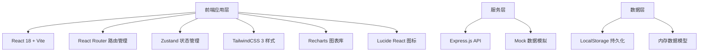

## 1. 架构设计



## 2. 技术描述

- **前端框架**：React 18 + TypeScript + Vite 5
- **路由管理**：React Router v6
- **状态管理**：Zustand (轻量级、高性能)
- **UI样式**：TailwindCSS 3 + 自定义CSS变量
- **图表库**：Recharts (React生态、配置灵活)
- **图标库**：Lucide React (线性图标、风格统一)
- **构建工具**：Vite 5 (热更新、极速构建)
- **后端服务**：Express.js (可选，当前使用Mock数据)
- **数据持久化**：LocalStorage + 内存状态
- **电子签署**：Canvas API 实现手写签名

## 3. 路由定义

| 路由路径 | 页面/组件 | 权限角色 | 说明 |
|---------|----------|----------|------|
| `/` | PortalHome | 公开 | 招商门户首页 |
| `/apply` | ApplicationForm | 公开 | 在线申请页面 |
| `/apply/success` | ApplySuccess | 公开 | 申请提交成功 |
| `/login` | LoginPage | 公开 | 统一登录页 |
| `/hq/dashboard` | HqDashboard | 总部管理员/专员 | 总部后台仪表盘 |
| `/hq/applications` | ApplicationList | 总部管理员/专员 | 申请列表 |
| `/hq/applications/:id` | ApplicationDetail | 总部管理员/专员 | 申请详情 |
| `/hq/databoard` | DataBoard | 总部管理员/专员 | 数据看板 |
| `/hq/notifications` | NotificationManage | 总部管理员 | 通知管理 |
| `/hq/policies` | PolicyManage | 总部管理员 | 政策管理 |
| `/store/dashboard` | StoreDashboard | 加盟商 | 加盟商后台首页 |
| `/store/agreement` | AgreementSign | 加盟商 | 协议签署 |
| `/store/resources` | ResourceCenter | 加盟商 | 资料中心 |
| `/store/notifications` | StoreNotifications | 加盟商 | 通知中心 |
| `/store/profile` | StoreProfile | 加盟商 | 门店资料 |

## 4. 数据模型定义

```typescript
// 用户类型
type UserRole = 'admin' | 'agent' | 'applicant' | 'franchisee';

interface User {
  id: string;
  username: string;
  password: string;
  role: UserRole;
  name: string;
  phone: string;
  email?: string;
  avatar?: string;
  createdAt: string;
}

// 申请阶段
type ApplicationStage = 'initial' | 'review' | 'contract' | 'preparation' | 'completed' | 'rejected';
type StageStatus = 'pending' | 'processing' | 'completed' | 'delayed';

interface Application {
  id: string;
  applicantName: string;
  phone: string;
  email: string;
  idCard: string;
  city: string;
  province: string;
  investmentAmount: number;
  experience: string;
  storeArea?: number;
  currentStage: ApplicationStage;
  stageStatus: StageStatus;
  assignedAgentId: string;
  stageHistory: StageRecord[];
  communicationRecords: CommunicationRecord[];
  agreementId?: string;
  createdAt: string;
  updatedAt: string;
  isDelayed: boolean;
  lastProgressAt: string;
}

interface StageRecord {
  stage: ApplicationStage;
  status: StageStatus;
  startedAt: string;
  completedAt?: string;
  note: string;
  operatorId: string;
}

interface CommunicationRecord {
  id: string;
  applicationId: string;
  agentId: string;
  content: string;
  type: 'phone' | 'meeting' | 'email' | 'other';
  nextFollowUp?: string;
  attachments?: string[];
  createdAt: string;
}

interface Agreement {
  id: string;
  applicationId: string;
  templateId: string;
  content: string;
  status: 'draft' | 'pending' | 'signed_hq' | 'signed_both' | 'rejected';
  hqSignature?: Signature;
  franchiseeSignature?: Signature;
  signedAt?: string;
  createdAt: string;
}

interface Signature {
  name: string;
  signatureData: string;
  signedAt: string;
  ip: string;
}

interface Notification {
  id: string;
  title: string;
  content: string;
  type: 'system' | 'policy' | 'training' | 'urgent';
  targetType: 'all' | 'region' | 'specified';
  targetRegions?: string[];
  targetUserIds?: string[];
  publisherId: string;
  publishAt: string;
  readCount: number;
  totalCount: number;
}

interface Policy {
  id: string;
  title: string;
  type: 'brand' | 'policy' | 'support';
  content: string;
  coverImage?: string;
  isPublished: boolean;
  createdAt: string;
  updatedAt: string;
}

interface Resource {
  id: string;
  title: string;
  type: 'material' | 'training' | 'manual';
  category: string;
  fileUrl: string;
  fileSize: number;
  downloads: number;
  createdAt: string;
}

interface DashboardStats {
  totalApplications: number;
  pendingReview: number;
  signedThisMonth: number;
  conversionRate: number;
  cityDistribution: { city: string; count: number }[];
  stageConversion: { stage: string; count: number; rate: number }[];
  monthlyTrend: { month: string; applications: number; signings: number }[];
  delayedApplications: Application[];
}
```

## 5. 前端项目结构

```
src/
├── assets/              # 静态资源
│   ├── images/
│   └── fonts/
├── components/          # 通用组件
│   ├── layout/         # 布局组件（Header、Sidebar、Footer）
│   ├── ui/             # 基础UI（Button、Card、Modal、Table）
│   └── business/       # 业务组件（Timeline、SignPad、StageBadge）
├── pages/              # 页面组件
│   ├── portal/         # 招商门户页面
│   ├── hq/             # 总部后台页面
│   ├── store/          # 加盟商后台页面
│   └── Login.tsx
├── store/              # 状态管理
│   ├── useAuthStore.ts
│   ├── useApplicationStore.ts
│   ├── useNotificationStore.ts
│   └── useDataStore.ts
├── types/              # TypeScript类型定义
│   └── index.ts
├── mock/               # Mock数据
│   ├── users.ts
│   ├── applications.ts
│   ├── policies.ts
│   └── resources.ts
├── utils/              # 工具函数
│   ├── date.ts
│   ├── format.ts
│   ├── signature.ts
│   └── storage.ts
├── hooks/              # 自定义Hooks
│   ├── useAuth.ts
│   ├── useAutoReminder.ts
│   └── useDelayedCheck.ts
├── App.tsx
├── main.tsx
└── index.css
```

## 6. 核心功能实现要点

### 6.1 自动提醒跟进机制
- 自定义Hook `useDelayedCheck` 定时检查所有申请的 `lastProgressAt` 时间
- 超过7天未更新阶段则标记 `isDelayed = true`
- 仪表盘显示延迟申请列表，推送系统通知提醒招商专员

### 6.2 阶段时间线组件
- 垂直时间线展示四个阶段的流转
- 当前阶段高亮显示，已完成阶段显示对勾
- 支持点击推进到下一阶段（需填写沟通记录）

### 6.3 电子签署功能
- 使用Canvas API实现手写签名板
- 支持鼠标和触摸设备签名
- 签名数据转换为Base64存储
- 双方签署完成后生成PDF预览

### 6.4 数据可视化
- Recharts实现转化漏斗图
- 中国城市意向分布热力图
- 月度趋势折线图
- 数字滚动动画效果

### 6.5 状态管理设计
- 按业务领域拆分多个Zustand Store
- 支持持久化到LocalStorage
- 中间件实现状态变更日志
```typescript
// Zustand Store 示例
const useApplicationStore = create<ApplicationState>((set, get) => ({
  applications: mockApplications,
  currentApplication: null,
  
  advanceStage: (id: string, note: string) => {
    const apps = get().applications;
    const app = apps.find(a => a.id === id);
    if (!app) return;
    
    const stageOrder: ApplicationStage[] = ['initial', 'review', 'contract', 'preparation', 'completed'];
    const currentIndex = stageOrder.indexOf(app.currentStage);
    if (currentIndex >= stageOrder.length - 1) return;
    
    const nextStage = stageOrder[currentIndex + 1];
    const now = new Date().toISOString();
    
    set({
      applications: apps.map(a => 
        a.id === id 
          ? {
              ...a,
              currentStage: nextStage,
              stageStatus: 'processing',
              lastProgressAt: now,
              isDelayed: false,
              stageHistory: [...a.stageHistory, {
                stage: nextStage,
                status: 'processing',
                startedAt: now,
                note,
                operatorId: 'current-user'
              }]
            }
          : a
      )
    });
  }
}));
```
